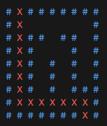

# 🧭 Maze Pathfinding Visualizer (Python curses)
This is a terminal-based maze pathfinding visualizer implemented in Python using the Breadth-First Search (BFS) algorithm and the curses module.

---

## 📌 Features
Visualizes step-by-step traversal of the shortest path using BFS.

Colored maze display:

- Blue: Maze walls and open paths

- Red: The found path from Start (O) to End (X)

Clean and interactive terminal rendering using the curses library.

---

## 🧩 Maze Format
- Represented as a 2D array.

- #: Wall

- O: Start point

- X: End point

- " " (space): Walkable path

---

## 🖼️ Screenshot
Here’s a screenshot of the Maze in action:




## 🚀 How It Works
- Start position (O) is located using findStart().

- BFS explores all possible paths using a queue until it finds the End (X).

- Each step is rendered in the terminal using colored output.

- Final path is shown in red, overlaid on the maze.

---

## 📦 Requirements
- Python 3.x

Works in Unix/macOS terminals and Windows terminals (e.g., Windows Terminal, VSCode terminal)

---

## 📥 Installation
- Clone this repository:

```
git clone https://github.com/yourusername/maze-visualizer.git
cd maze-visualizer
```

- Run the program:

```
python maze_visualizer.py
```

⚠️ Note: This is a terminal-based app. Don't run it in IDLE or standard Python GUI shells.

---

## 🧠 Key Concepts Used
- curses library for terminal control

- queue.Queue for BFS

- 2D grid traversal

- Color pairs in terminal rendering

- Tuple-based coordinate management
